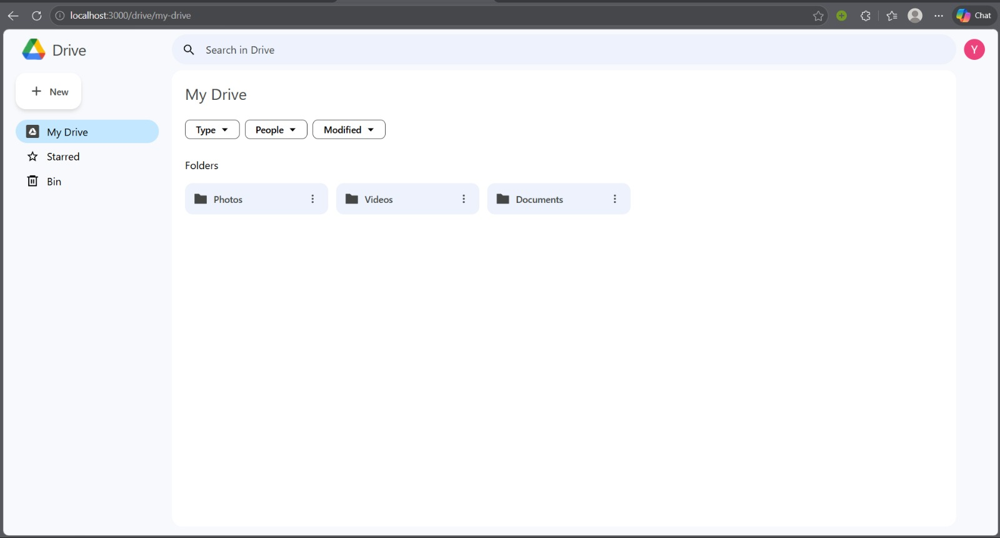

# Google Drive Clone: Full-Stack Cloud Storage Platform



**Google Drive Clone** is a robust, full-stack cloud storage application designed to replicate the seamless file management and collaborative experience of the official Google Drive ecosystem. Built with a focus on high-performance state management and real-time data persistence, this platform serves as a production-grade template for scalable cloud solutions.

---

## 🛠 Technical Architecture

The platform leverages a modern distributed architecture to ensure low latency and high availability:

| Layer | Technology | Purpose |
| :--- | :--- | :--- |
| **Frontend** | [Next.js 13](https://nextjs.org/) | Server-side rendering & optimized routing |
| **Logic** | [React 18](https://react.dev/) | Component-driven UI and state management |
| **Styling** | [Tailwind CSS](https://tailwindcss.com/) | Responsive, utility-first design system |
| **Persistence** | [Firebase](https://firebase.google.com/) | Real-time NoSQL database & blob storage |
| **Identity** | [NextAuth.js](https://next-auth.js.org/) | Secure OAuth-ready authentication flow |
| **Verification** | [TypeScript](https://www.typescriptlang.org/) | End-to-end type safety |

---

## 🚀 Key Features

### 🔐 Secure Multi-Tenant Authentication
Implemented via **NextAuth.js**, providing secure, isolated user sessions. The system is designed to handle credential-based and OAuth providers, ensuring data privacy across the platform.

### 📁 Real-Time File Ecosystem
Leveraging **Firebase Firestore** and **Storage**, the platform enables instant file uploads, metadata synchronization, and hierarchical folder navigation with zero-refresh updates.

### 🔍 Advanced Search & Discovery
Integrated indexed search functionality allows for instantaneous retrieval of documents and folders based on naming conventions and metadata tags.

### 📱 Responsive Engineering
A mobile-first design strategy ensures the interface remains performant and visually consistent across desktop, tablet, and mobile breakpoints.

---

## ⚙️ Getting Started

To deploy this environment locally, ensure you have **Node.js 18+** installed.

### 1. Initialization
```bash
git clone https://github.com/nykr1607/Google-Drive-Clone.git
cd Google-Drive-Clone
npm install
```

### 2. Environment Configuration
Create a `.env` file in the root directory (referencing `.env.example`) and populate your Firebase and NextAuth credentials.

### 3. Execution
```bash
npm run dev
```

The application will be accessible at [http://localhost:3000](http://localhost:3000).

---

## 🤝 Contributions & Support

We welcome technical contributions to enhance the platform's scalability. Please feel free to open architectural discussions in the **Issues** section.

**Maintained by [nykr1607](https://github.com/nykr1607), [suki2811](https://github.com/suki2811) and [Pavansai1611](https://github.com/Pavansai1611)**
